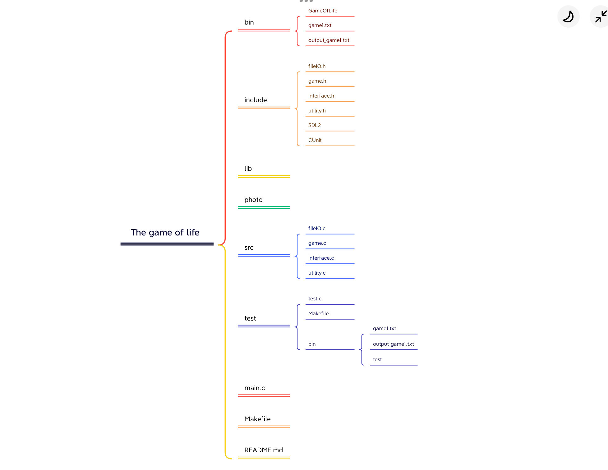

# GameOfLife

#### Description
This project is a game about “Conway’s game of life” using C language and the SDL2library. Based on the original rules, the project displays the animations of each evolution step in a window, white blocks replacing alive cells and other blocks replacing dead cells. Each game needs a file to load the initial state of the world and another file to record the last state of the world.

#### Project Architecture



#### Something to be noted:

1. The bin directory stores the initial world file like "game1.txt", the output world file like "output_game1.txt" and the executable file named "GameOfLife". Also, you can see "output_game1.txt" as an initial world file.

2. The test directory stores the files which can do the unit testing of the project "GameOfLife". (**DON'T move or modify any file in the test directory!!**)

   **To test: **

   ```
   # go to the test directory
   1. cd test
   
   # make
   2. make all
   
   # run the testing program
   3. ./bin/test   (In windows, run '.\bin\test')
   ```

#### How to play:

```
# make
1. make all

# run the game program
2. ./bin/GameOfLife "game1.txt"    (In windows, run '.\bin\GameOfLife "game1.txt"')
```

+ You must give a fileName parameter, in order to specify the initial world.
+ The game has 2 modes; one is make it run without specification of numbers of generations, and the other is make it run with specification of numbers of generations.
+ After running, the result world will be stored in the bin directory.

#### Git log screen:

