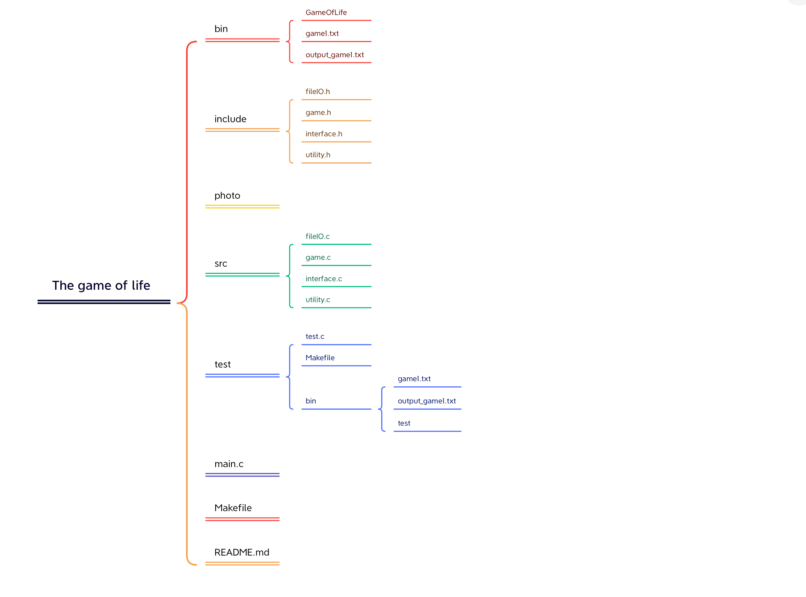

# GameOfLife

#### Description
This project is a game about “Conway’s game of life” using C language and the SDL2library. Based on the original rules, the project displays the animations of each evolution step in a window, white blocks replacing alive cells and black blocks replacing dead cells. Each game needs a file to load the initial state of the world and another file to record the last state of the world.

#### Project Architecture

#### Installation

1.  xxxx
2.  xxxx
3.  xxxx

#### Instructions

1.  xxxx
2.  xxxx
3.  xxxx

#### Contribution

1.  Fork the repository
2.  Create Feat_xxx branch
3.  Commit your code
4.  Create Pull Request

#### Gitee Feature

1.  You can use Readme\_XXX.md to support different languages, such as Readme\_en.md, Readme\_zh.md
2.  Gitee blog [blog.gitee.com](https://blog.gitee.com)
3.  Explore open source project [https://gitee.com/explore](https://gitee.com/explore)
4.  The most valuable open source project [GVP](https://gitee.com/gvp)
5.  The manual of Gitee [https://gitee.com/help](https://gitee.com/help)
6.  The most popular members  [https://gitee.com/gitee-stars/](https://gitee.com/gitee-stars/)
